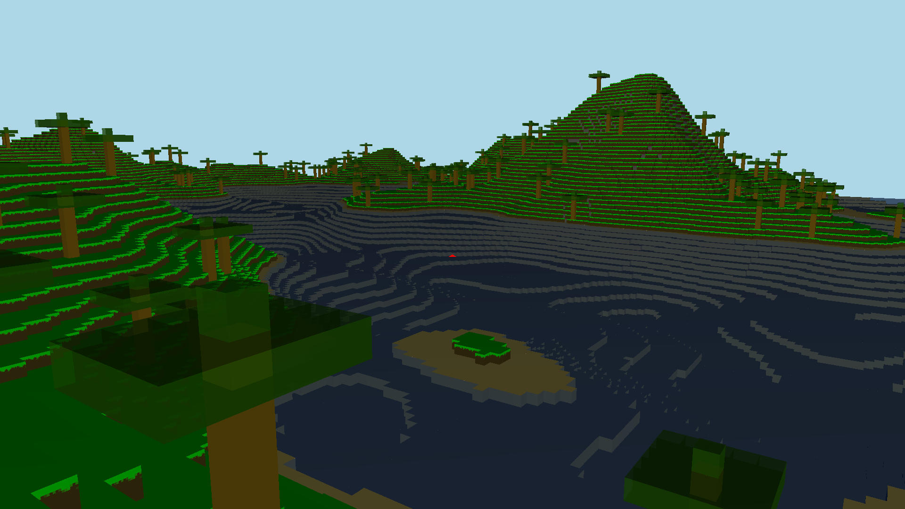

# Minecraft opengl clone written in c++
Reason? `Why not...`

 
# How to run
1. Download latest release and run it
2. Build from source:
 - Install `GLFW`(https://www.glfw.org/download.html)
 - In cmd or terminal: `g++ -std=c++20 vendor/stb_image/stb_image.cpp vendor/glad/glad.c *.cpp -o main -lglfw -lGL`
 - run binary
 
 # WASM setup
 1. Compile with emscripten: `emcc *.cpp  vendor/glad/glad.o vendor/stb_image/stb_image.cpp -std=c++20   -s USE_GLFW=3   -s FULL_ES3=1   -s MIN_WEBGL_VERSION=2 -s MAX_WEBGL_VERSION=2   -s ALLOW_MEMORY_GROWTH=1   -s EXIT_RUNTIME=0   -s MINIFY_HTML=0 -s ENVIRONMENT=web,worker -s DEMANGLE_SUPPORT=0 --preload-file textures/  -s USE_PTHREADS=1 -pthread  --preload-file shaders/   -O3   -o index.html`
 2. run server with python: `emrun --no_browser --port 8000 index.html`
 3. enter: [http://0.0.0.0:8080/](http://0.0.0.0:8080/) in your browser
