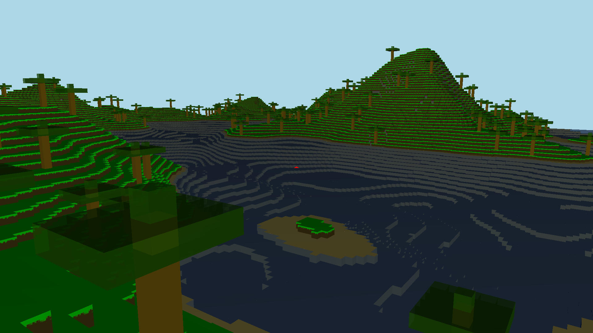

# Minecraft opengl clone written in c++
Reason? `Why not...`

 
# How to run
1. Download latest release and run it
2. Build from source:
 - Install `GLFW`(https://www.glfw.org/download.html)
 - enter: `<main project dir>/game/` dir in terminal
 - In cmd or terminal: `g++ -std=c++20 vendor/stb_image/stb_image.cpp vendor/glad/glad.c *.cpp -o main -lglfw -lGL`
 - run binary
3. Build from source WASM:
 - Make sure to have emscripten CLI installed
 - In cmd or terminal in `<main project dir>/website/gameWebsite`:
    - Use default emscripten HTML:`emcc ../../game/*.cpp  ../../game/vendor/glad/glad.o ../../game/vendor/stb_image/stb_image.cpp -std=c++20   -s USE_GLFW=3   -s FULL_ES3=1   -s MIN_WEBGL_VERSION=2 -s MAX_WEBGL_VERSION=2   -s ALLOW_MEMORY_GROWTH=1   -s EXIT_RUNTIME=0   -s MINIFY_HTML=0 -s ENVIRONMENT=web,worker -s DEMANGLE_SUPPORT=0 --preload-file ../../game/textures@textures  -s USE_PTHREADS=1 -pthread  --preload-file ../../game/shaders@shaders   -O3  -o index.html`
    - Use your custom HTML: `emcc ../../game/*.cpp  ../../game/vendor/glad/glad.o ../../game/vendor/stb_image/stb_image.cpp -std=c++20   -s USE_GLFW=3   -s FULL_ES3=1   -s MIN_WEBGL_VERSION=2 -s MAX_WEBGL_VERSION=2   -s ALLOW_MEMORY_GROWTH=1   -s EXIT_RUNTIME=0   -s MINIFY_HTML=0 -s ENVIRONMENT=web,worker -s DEMANGLE_SUPPORT=0 --preload-file ../../game/textures@textures  -s USE_PTHREADS=1 -s MODULARIZE=1 -s 'EXPORT_NAME="MyGame"' -pthread  --preload-file ../../game/shaders@shaders -s -O3 -lembind -o files/webGame/game.js`
 - (If you want to use your own HTML then insert it in `<main project dir>/website/gameWebsite` just keep in mind module you will be calling is `MyGame`)
 - run server in `<main project dir>/website/gameWebsite`: `emrun --no_browser --port 8000 index.html`
 - enter: [http://localhost:8080/](http://localhost:8080/) in your browser

